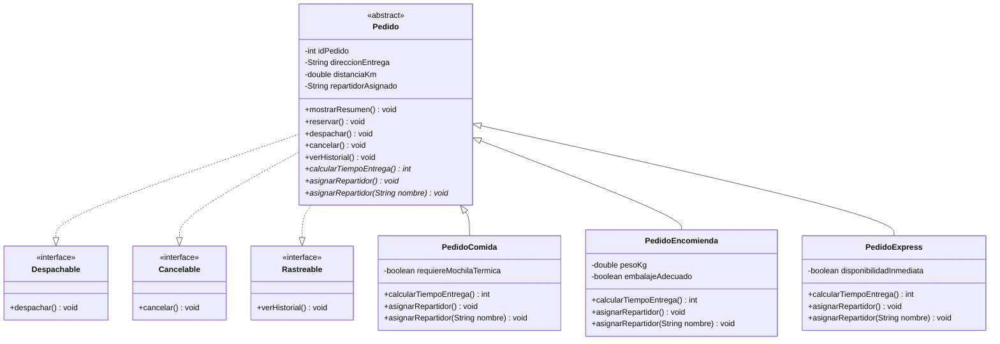

# Diagrama de clases - SpeedFast Semana 3

`Pedido` implementa las tres interfaces y las subclases heredan esos contratos. Cada subclase personaliza el cálculo de tiempo y las dos formas de asignación de repartidor.
